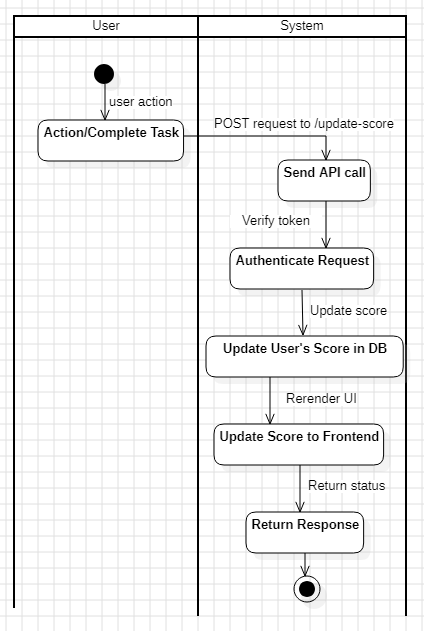

# Problem 6: Architecture

> ## Overview
*This module provides an API for updating user scores after completing an action. The API ensures that only authorized requests can update the scores and provides real-time updates for the scoreboard. It is also designed to prevent malicious users from abusing the system to increase their scores without authorization.*

> ## API Specifications
- [ ] **Endpoint**: /update-score
- [ ] **Method**: POST
- [ ] **Description**: Updates the score for a user after they complete an action.
- [ ] **Request Body (JSON)**
```json
        {
            "user_id": "string",
            "action_id": "string",
            "new_score": "integer"
        }
```
- [ ] **Response (Success - 200 OK)**
```json
        {
            "status": "success",
            "message": "Score updated successfully"
        }
```
- [ ] **Response (Unauthorized - 401 Unauthorized)**
```json
        {
            "status": "error",
            "message": "Unauthorized access. Invalid or missing authentication token"
        }
```
- [ ] **Response (Bad Request - 400)**
```json
        {
            "status": "error",
            "message": "Invalid input data or missing required fields."
        }
```
> ## Flow of Execution
**User Action Trigger**
- A user performs an action, which will result in the dispatch of an API request to update their score.

**API Call to Update Score**
- The frontend sends a POST request to /update-score with the user_id, action_id, and new_score.

**Authentication & Authorization**
- The server verifies the authentication token included in the request headers (e.g., using JWT or OAuth). 
- If the token is invalid or missing, the request is rejected with a 401 Unauthorized status.

**Score Update**
- Upon successful authentication, the server processes the score update: It validates the request data (ensuring user_id, action_id, and new_score are present and valid). 
- It updates the user's score in the database.

**Real-time Update**
- After the score is updated, the system pushes the updated score to the live scoreboard. This can be done using WebSockets or a similar push mechanism to update the front-end in real-time.

**Response**
- The server sends a response back to the frontend with a status message:
- [ ] 200 OK for successful updates.
- [ ] 400 Bad Request if the request is invalid.
- [ ] 401 Unauthorized if the authentication fails.

> ## Activity Diagram


> ## Security & Authorization
- Authentication: Every request to update the score must include a valid authentication token (JWT token) in the Authorization header.
- Authorization: The server will verify that the user is authorized to perform the action. This could involve checking user roles, actions, and permissions based on the action they are performing.
- Rate Limiting: To prevent abuse, the system may implement rate-limiting for API requests to ensure that users cannot spam the system with requests to increase their score.
- Input Validation: The API will validate the request body to ensure that all necessary fields (user_id, action_id, and new_score) are present and properly formatted.

> ## Additional Comments for Improvement
- Score Validation: A user’s score should be validated to ensure it falls within reasonable bounds. Scores should not decrease unless explicitly allowed by the system.
- Caching: To reduce the load on the database and improve performance, consider using caching for the top 10 scores. This way, only the top 10 scores are kept in memory, and the database is updated only when a score is updated.
- Logging and Monitoring: Implement logging and monitoring to track failed attempts, security breaches, and other anomalous behavior. This will be crucial for troubleshooting and preventing fraud.
- Rate Limiting: Implement rate-limiting to prevent excessive API calls in a short period. For example, limit the number of score updates a user can perform within a given timeframe.

